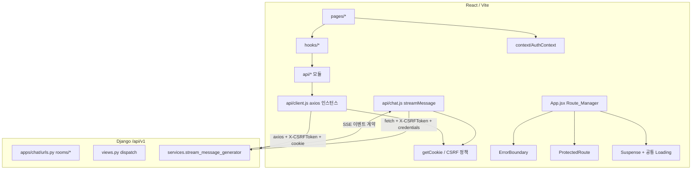

# 설계 문서

## Overview
## 개요

이 설계는 `maple-chatbot-mai-v2`의 **프론트엔드-백엔드 연계 정합성**과 **디자인/UX 개선**을 위한 것이다. 요구사항 문서(11개)에서 정의한 문제들을 실제 코드 구조에 매핑하여 구체적 구현 방향을 제시한다.

핵심 목표는 다음과 같다.

- 채팅 SSE 스트리밍이 공용 `API_Client`(axios)와 동일한 인증/CSRF 정책을 따르도록 정합화 (요구사항 1)
- 커뮤니티 목업 상태 명시 및 죽은 코드(`api/community.js`) 제거 (요구사항 2)
- 채팅 세션/메시지 응답의 **단일 스키마 계약** 확정 및 방어 코드(`||`) 제거 (요구사항 3)
- 중복 정의(`searchCharacter`)와 문서-코드 드리프트(`urls.py` docstring, `STYLES_STRUCTURE.md`) 정리 (요구사항 4)
- `alert('구현 예정')` UI를 실제 기능(SignupPopup, 프로필 상세)으로 연결 (요구사항 5)
- 채팅 사이드바의 하드코딩 프로필 → `Auth_Context` 실제 데이터 (요구사항 6)
- 중복 레거시 CSS 정리 및 디자인 토큰 일관화 (요구사항 7, 8)
- 접근성(aria-label, 라벨, 포커스 트랩/ESC) 공통 처리 (요구사항 9)
- 코드 스플리팅, ErrorBoundary, ProtectedRoute, 공통 로딩 UI (요구사항 10)
- AdSense client id 구성화 및 무효 시 미로드 (요구사항 11)

이 설계는 프론트엔드 정합성과 디자인 개선에 초점을 맞춘다. 백엔드 신규 기능(커뮤니티 앱 신설)은 범위 밖이며, 커뮤니티는 목업을 유지한다.

### 현재 코드 분석 요약 (근거)

설계 판단의 근거가 된 실제 코드 상태는 다음과 같다.

- `api/client.js`: axios 인스턴스가 `withCredentials: true` + 요청 인터셉터로 `getCookie('csrftoken')`을 `X-CSRFToken` 헤더에 주입한다. 이것이 표준 정책이다.
- `api/chat.js`의 `streamMessage`: 공용 클라이언트를 우회하는 **raw `fetch`**로 구현되어 있고, `X-CSRFToken` 헤더도 `credentials`도 없다. (요구사항 1의 결함 지점)
- `apps/chat/services.py`의 `stream_message_generator`: SSE 이벤트를 `data: {"type": "token"|"error", "content": "..."}\n\n` 형태로 내보내고, 완료 신호는 하위 AI 서버에서 온 `data: [DONE]`을 그대로 전달한다.
- 백엔드 응답 필드는 이미 `rooms`/`room`/`messages`/`sender_type`/`message_content`로 정형화되어 있으나, 프론트엔드가 `response.data.rooms || response.data.data`, `msg.sender_type || msg.role` 등 **대체 필드 방어 코드**를 유지 중이다. (요구사항 3)
- 세션 타임스탬프 필드 불일치: `get_sessions`는 `updated_at`(값은 `created_at`)을, `create_session`은 `created_at`을 반환한다. 사이드바는 `session.created_at || session.updated_at`으로 흡수 중이다. (요구사항 3에서 단일화 대상)
- `searchCharacter`가 `api/home.js`와 `api/character.js` **양쪽에 중복 정의**되어 있고, 두 훅이 서로 다른 모듈을 사용한다. (요구사항 4)
- `apps/chat/urls.py` docstring은 옛 `/sessions/` 경로를 설명하지만 실제 라우팅은 `/rooms/`이다. (요구사항 4)
- `ChatSidebar.jsx`가 `Lv.285 / 아델 / MAI` 등을 하드코딩한다. (요구사항 6)
- `components/common/AdSense.jsx`는 이미 `import.meta.env.VITE_ADSENSE_CLIENT_ID` 기반이지만, `index.html`에는 `ca-pub-XXXXXXXXXXXXXXXX` 플레이스홀더 스크립트가 무조건 로드된다. (요구사항 11)
- `App.jsx`는 정적 import + catch-all `Navigate to="/"`만 있고, lazy/Suspense/ErrorBoundary/ProtectedRoute가 없다. (요구사항 10)

## Architecture
## 아키텍처

### 계층 구조



### 설계 원칙

1. **단일 CSRF/인증 정책**: 쿠키에서 CSRF 토큰을 읽어 `X-CSRFToken`으로 보내고 자격 증명을 포함하는 규칙을 한 곳(`getCookie` + 공유 헬퍼)에서 관리한다. `streamMessage`도 이 규칙을 재사용한다.
2. **단일 스키마 계약**: 백엔드가 실제로 내보내는 필드명을 계약으로 확정하고, 프론트엔드는 대체 필드 분기 없이 그 필드만 읽는다.
3. **단일 정의 원칙**: 함수는 한 모듈에서만 정의하고 다른 곳은 재사용한다.
4. **문서-코드 일치**: docstring과 가이드 문서는 실제 코드 상태를 반영한다.
5. **공통 UI 추출**: 로딩/오류/보호 라우트/접근성 처리를 재사용 컴포넌트로 추출한다.

## Components and Interfaces
## 컴포넌트 및 인터페이스

### 1. Chat_Stream_Module (요구사항 1, 3)

`api/chat.js`의 `streamMessage`를 공용 정책과 정합화한다.

- **CSRF/자격 증명**: `client.js`에서 `getCookie`를 재사용(이미 export됨)하여 `fetch` 호출에 헤더를 추가한다.

```js
// api/chat.js (설계 의도)
import { getCookie } from './client';

export const streamMessage = async (sessionId, content, onChunk, onDone, onError) => {
  let doneCalled = false;
  const callDone = () => { if (!doneCalled) { doneCalled = true; onDone(); } };
  try {
    const csrftoken = getCookie('csrftoken');
    const response = await fetch(`/api/v1/chat/rooms/${sessionId}/stream/`, {
      method: 'POST',
      credentials: 'include',                         // 요구사항 1.2
      headers: {
        'Content-Type': 'application/json',
        ...(csrftoken ? { 'X-CSRFToken': csrftoken } : {}), // 요구사항 1.1, 1.3
      },
      body: JSON.stringify({ content }),
    });

    if (!(response.ok)) {                             // status 200-299 밖 → 요구사항 1.4
      onError({ status: response.status, message: `HTTP ${response.status}` });
      return;
    }
    // ... SSE 파싱 루프 (아래 SSE 계약 참조) ...
    // '[DONE]' 수신 또는 스트림 종료 시 callDone() 로 정확히 1회 보장 (요구사항 1.5)
  } catch (error) {
    onError(error);
  }
};
```

- **완료 콜백 1회 보장(요구사항 1.5)**: 현재 코드는 `[DONE]` 처리 후 `return`하지만, 스트림이 `[DONE]` 없이 끝나는 경로와 겹칠 수 있으므로 `doneCalled` 가드로 정확히 한 번만 호출한다.
- **오류 콜백(요구사항 1.4)**: 성공 범위(200–299)를 벗어나면 상태 코드를 포함한 오류 객체로 `onError`를 호출한다. `useChat`의 `onError`는 이미 마지막 assistant 메시지에 오류 표시를 붙인다.

#### SSE 스키마 계약 (요구사항 1, 3)

백엔드 `stream_message_generator` 구현을 계약으로 확정한다. 각 SSE 이벤트는 `data: <payload>\n\n` 형식이며 payload는 다음 중 하나다.

| 이벤트 | payload 형태 | 프론트 처리 |
|--------|--------------|-------------|
| 토큰 | `{"type": "token", "content": "<부분 텍스트>"}` | `onChunk` → 누적 표시 |
| 오류 | `{"type": "error", "content": "<오류 메시지>"}` | `onChunk`에서 `type==='error'` 분기 로깅 |
| 종료 | `[DONE]` (JSON 아님, 리터럴) | `onDone` 1회 호출 |

- 파서는 네트워크 청크 경계와 무관하게 `\n\n` 구분자로 이벤트를 분리하고, 마지막 미완성 조각은 버퍼에 유지한다.
- `data: ` 접두사가 없는 라인은 무시한다.
- JSON 파싱 실패 조각은 스트림 전체를 중단시키지 않고 건너뛴다(경고 로깅).

#### 채팅 세션/메시지 스키마 계약 (요구사항 3)

백엔드 실제 출력에 맞춰 단일 필드명을 확정하고, 프론트의 `|| response.data.data`, `|| msg.role`, `|| msg.content` 등 대체 분기를 제거한다.

| 대상 | 확정 필드 | 비고 |
|------|-----------|------|
| 세션 목록 응답 | `{ success, rooms: Room[] }` | `data` 대체 제거 |
| 세션 생성 응답 | `{ success, room: Room }` | `data` 대체 제거 |
| Room 객체 | `{ id, room_name, created_at }` | **타임스탬프를 `created_at`으로 단일화** (백엔드 `get_sessions`의 `updated_at`을 `created_at`으로 수정) |
| 메시지 목록 응답 | `{ success, messages: Message[] }` | |
| Message 객체 | `{ id, sender_type, message_content, thinking?, sent_at }` | `role`/`content` 대체 제거 |

- **필수 필드 누락 처리(요구사항 3.4)**: 응답에 계약상 필수 필드가 없으면 `console.error`로 기록하고, 훅은 오류 상태를 반환하여 UI가 오류를 표시한다(무음 실패 금지).

### 2. Community_Module (요구사항 2)

- `hooks/useCommunity.js` 및 `pages/CommunityPage.jsx` 상단에 "이 기능은 목업 데이터 소스를 사용한다"는 주석을 명시한다(요구사항 2.1).
- 어떤 모듈에서도 import되지 않는 `api/community.js`를 삭제한다(요구사항 2.2). (검색 결과 실제 참조 없음이 확인됨)
- 게시글 목록 요청 시 목업 소스(`mockPostsList`)에서 필터/정렬하여 반환하는 현재 동작을 유지한다(요구사항 2.3).

### 3. 중복/드리프트 정리 (요구사항 4)

- **`searchCharacter` 단일화**: `api/character.js`를 정본으로 하고, `api/home.js`의 정의는 제거한 뒤 `useCharacterSearch.js`가 `characterApi.searchCharacter`를 사용하도록 변경한다(또는 `home.js`가 `character.js`에서 재-export). 두 정의는 동일 엔드포인트(`/api/v1/character/search/`)를 호출하므로 동작 변화는 없다(요구사항 4.1).
- **`apps/chat/urls.py` docstring**: 옛 `/sessions/...` 설명을 실제 `/rooms/...` 라우팅에 맞게 갱신한다(요구사항 4.2).
- **`STYLES_STRUCTURE.md`**: 실제 CSS 파일 구조와 일치하도록 갱신한다(요구사항 4.3, 요구사항 7과 연계).

### 4. 미구현 UI 연결 (요구사항 5)

- **회원가입**: `LoginPage`/`LoginPopup`의 회원가입 진입점이 `AuthContext.openSignupModal()`을 호출하여 기존 `SignupPopup` 컴포넌트를 표시하도록 연결한다(요구사항 5.1). `AuthContext`에는 이미 `isSignupModalOpen`/`openSignupModal`이 존재한다.
- **프로필 상세**: `ChatSidebar`의 `onClick={() => alert('상세 정보 기능 구현 예정')}`를 실제 네비게이션(예: 프로필 상세 뷰/라우트로 이동)으로 대체한다(요구사항 5.2).
- 기능이 연결된 UI에서 `alert('구현 예정')` 패턴을 제거한다(요구사항 5.3).

### 5. Chat_Sidebar 실제 프로필 (요구사항 6)

`Auth_Context`의 `user`를 사용한다. `user`는 `getUserInfo` 응답 전체(`{ user: {...}, maple_nickname, ... }`)이다.

- 로그인 시 프로필 항목(레벨/직업/길드/서버)을 `user`의 해당 필드에서 읽는다(요구사항 6.1).
- 값이 없으면 항목별 대체 표시(예: `미설정` / `-`)를 렌더한다(요구사항 6.2).
- `Lv.285 / 아델 / MAI / LUNA` 같은 고정값 하드코딩을 제거한다(요구사항 6.3).
- 비로그인 시 게스트 상태 표시를 유지한다(요구사항 6.4).

> 참고: 현재 백엔드 `getUserInfo`가 레벨/직업/길드/서버를 제공하지 않을 수 있다. 이 경우 해당 항목은 항상 "미설정" 대체 표시로 렌더되며(요구사항 6.2로 충족), 실데이터 연동 시 필드만 매핑하면 된다. 표시 로직은 값 유무에 따라 동작하도록 설계한다.

### 6. 공통 라우팅/UI 컴포넌트 (요구사항 10)

`components/common/`에 추가한다.

- **`LoadingFallback`**: Suspense fallback 및 페이지 로딩 표시용 공통 컴포넌트(요구사항 10.2).
- **`ErrorBoundary`**: `componentDidCatch`/`getDerivedStateFromError`를 구현한 클래스 컴포넌트. 대체 오류 UI를 렌더한다(요구사항 10.3).
- **`ProtectedRoute`**: `AuthContext`의 `isLoggedIn`/`isLoading`을 확인하여 비로그인 시 `<Navigate to="/login" replace />`로 이동(요구사항 10.4). `isLoading` 동안에는 `LoadingFallback`을 표시하여 인증 확인 전 잘못된 리다이렉트를 방지한다.

`App.jsx` 재구성:

```jsx
const HomePage = React.lazy(() => import('./pages/HomePage'));      // 요구사항 10.1
// ... 나머지 페이지도 lazy ...

<AuthProvider>
  <Router>
    <ErrorBoundary>                                   {/* 요구사항 10.3 */}
      <Suspense fallback={<LoadingFallback />}>        {/* 요구사항 10.2 */}
        <Routes>
          <Route path="/" element={<HomePage />} />
          <Route path="/login" element={<LoginPage />} />
          <Route path="/chat" element={<ChatPage />} />
          <Route path="/character" element={<CharacterPage />} />
          <Route path="/community" element={<CommunityPage />} />
          {/* 인증 필요 라우트는 ProtectedRoute로 감쌈 (요구사항 10.4) */}
          <Route path="*" element={<Navigate to="/" replace />} />
        </Routes>
      </Suspense>
    </ErrorBoundary>
  </Router>
</AuthProvider>
```

> 어떤 라우트를 보호할지는 제품 정책 결정 사항이다. 설계상 `ProtectedRoute`는 재사용 가능한 래퍼로 제공하고, 최소한 인증이 전제되는 뷰(예: 프로필 상세)에 적용한다.

### 7. AdSense_Config (요구사항 11)

- `index.html`의 하드코딩 AdSense 스크립트 태그(`client=ca-pub-XXXXXXXXXXXXXXXX`)를 제거한다.
- 스크립트 로드는 유효한 client id가 구성된 경우에만 수행한다. `import.meta.env.VITE_ADSENSE_CLIENT_ID`를 기준으로 하고, 값이 없거나 플레이스홀더(`ca-pub-XXXXXXXXXXXXXXXX`)면 로드하지 않는다(요구사항 11.1, 11.2).
- 로드 판단 헬퍼 `isValidAdSenseClientId(id)`를 도입: 비어있지 않고, `ca-pub-` 접두사 + 실제 숫자열(플레이스홀더 `X` 아님)일 때만 `true`.
- 스크립트 주입은 `AdSense` 컴포넌트(또는 전용 로더 훅)에서 조건부로 동적 삽입한다. `AdSense.jsx`는 이미 `VITE_ADSENSE_CLIENT_ID` 미설정 시 `null`을 반환하므로 이 정책을 `isValidAdSenseClientId`로 강화한다.

### 8. 접근성 (요구사항 9)

- 아이콘/이모지 전용 버튼(`➤` 전송, `🧠` 사고 등)에 `aria-label` 부여(요구사항 9.1).
- 채팅 입력 `textarea`에 연관 라벨(`aria-label` 또는 시각적 숨김 `<label htmlFor>`) 부여(요구사항 9.2).
- **공통 모달 처리**: 모달(Login/Signup Popup, CommunityWriteModal 등)에 공통 훅 `useModalA11y(isOpen, onClose)`를 도입한다.
  - 열려 있는 동안 포커스를 모달 내부로 제한(포커스 트랩): 첫/마지막 포커서블 사이에서 Tab 순환(요구사항 9.3).
  - `Escape` 키 입력 시 `onClose` 호출(요구사항 9.4).
  - 열릴 때 첫 포커서블로 포커스 이동, 닫힐 때 트리거로 복귀.

### 9. Style_System (요구사항 7, 8)

- **구조 단일화(요구사항 7)**: `styles/globals`, `styles/pages`, `styles/components`를 정본으로 하고 루트 레거시 파일(`styles/home.css`, `chat.css`, `character.css`, `community.css`, `common.css`) 중 신규 구조와 중복되는 것을 제거/통합한다(요구사항 7.1, 7.2). 모든 import 경로를 신규 구조로 갱신한다(요구사항 7.3). `STYLES_STRUCTURE.md`가 최종 상태와 일치하도록 갱신한다.
- **디자인 토큰(요구사항 8)**: 인라인 하드코딩 색상(예: `#c62828`, `#ffb7c5`)을 `styles/globals/variables.css`의 CSS 변수로 치환한다(요구사항 8.1). 토큰에 없는 색은 새 토큰을 정의(요구사항 8.2)하고, 컴포넌트는 항상 토큰을 참조한다(요구사항 8.3). JSX 인라인 `style`의 하드코딩 색상도 CSS 변수(`var(--...)`) 또는 클래스로 이전한다.

## Data Models
## 데이터 모델

### 프론트엔드 정규화 모델 (스키마 계약 반영)

```ts
// Room (채팅 세션)
type Room = {
  id: string;            // UUID 문자열
  room_name: string;     // 표시용 제목
  created_at: string;    // ISO 8601 (단일화: updated_at 대체 폐기)
};

// Message
type Message = {
  id: number;
  sender_type: 'user' | 'assistant';
  message_content: string;
  thinking?: string;     // assistant 전용
  sent_at: string;       // ISO 8601
};

// UI에서 사용하는 정규화 메시지 (렌더 모델)
type UIMessage = {
  role: 'user' | 'assistant';   // sender_type에서 매핑
  content: string;              // message_content에서 매핑
  thinking: string;
};
```

### SSE 이벤트 모델

```ts
type SSEEvent =
  | { type: 'token'; content: string }
  | { type: 'error'; content: string }
  | '[DONE]';   // 리터럴 종료 신호
```

### AdSense 구성 모델

```ts
// import.meta.env.VITE_ADSENSE_CLIENT_ID: string | undefined
// 유효성: 비어있지 않고 'ca-pub-' + 숫자열, 플레이스홀더(X...) 아님
function isValidAdSenseClientId(id?: string): boolean;
```

### 사용자 프로필 표시 모델 (사이드바)

```ts
// AuthContext.user = getUserInfo 응답 전체
// { user: { id, username, email }, maple_nickname, ... }
type ProfileField = { label: string; value: string | null };
// value가 null/undefined/'' 이면 "미설정" 대체 표시
```

## Correctness Properties

*속성(property)이란 시스템의 모든 유효한 실행에서 참이어야 하는 특성 또는 동작으로, 시스템이 무엇을 해야 하는지에 대한 형식적 진술이다. 속성은 사람이 읽는 명세와 기계로 검증 가능한 정확성 보장 사이의 다리 역할을 한다.*

아래 속성들은 프론트엔드 통합 로직 중 **순수 함수/결정적 매핑/파서 성격**을 가진 부분에 대한 것이다. CSS 정리(요구사항 7, 8), 문서 드리프트(요구사항 4), 목업 주석(요구사항 2.1) 등 정적/구성 성격의 기준은 속성 기반 테스트 대신 정적 검사·스냅샷·예시 테스트로 다룬다(아래 테스팅 전략 참조).

### Property 1: 스트리밍 요청은 쿠키의 CSRF 토큰을 헤더로 전송한다

*For any* csrftoken 쿠키 값(임의의 유효 토큰 문자열)에 대해, `streamMessage`가 보내는 요청의 `X-CSRFToken` 헤더는 `getCookie('csrftoken')`로 읽은 값과 동일해야 하며, 자격 증명(`credentials: 'include'`)이 포함되어야 한다.

**Validates: Requirements 1.1, 1.2, 1.3**

### Property 2: 성공 범위를 벗어난 응답은 상태 코드와 함께 오류 콜백을 부른다

*For any* 성공 범위(200–299)를 벗어난 HTTP 상태 코드에 대해, `streamMessage`는 `onError`를 호출하고 전달 정보에 해당 상태 코드를 포함해야 하며, `onDone`을 호출하지 않아야 한다.

**Validates: Requirements 1.4**

### Property 3: 종료 신호 수신 시 완료 콜백은 정확히 한 번 호출된다

*For any* SSE 토큰 이벤트 열과 `[DONE]` 종료 신호를, 임의의 바이트 청크 경계로 분할한 스트림에 대해, `streamMessage`는 `onDone`을 정확히 한 번 호출해야 한다.

**Validates: Requirements 1.5**

### Property 4: 커뮤니티 목업 목록은 필터·정렬 계약을 만족한다

*For any* 목업 게시글 집합과 선택된 카테고리·정렬 기준에 대해, 반환된 목록은 (a) 원본 집합의 부분집합이고, (b) 카테고리가 'all'이 아니면 모든 원소의 카테고리가 선택값과 일치하며, (c) 선택된 정렬 기준에 따라 정렬되어 있어야 한다.

**Validates: Requirements 2.3**

### Property 5: 계약을 따르는 응답은 정의된 단일 필드로 매핑된다

*For any* 스키마 계약을 따르는 Room/Message 응답에 대해, 매핑 함수는 대체 필드 분기 없이 `role = sender_type`, `content = message_content`, 세션 타임스탬프 = `created_at`으로 UI 모델을 생성해야 한다.

**Validates: Requirements 3.1, 3.2, 3.3**

### Property 6: 필수 필드가 누락되면 오류가 기록되고 오류 상태가 표시된다

*For any* 계약상 필수 필드 중 하나가 제거된 응답에 대해, 매핑/검증 로직은 오류를 기록하고 오류 상태를 반환하여 UI가 오류를 표시하도록 해야 한다(무음 실패 금지).

**Validates: Requirements 3.4**

### Property 7: 부재한 프로필 항목은 대체 표시로 렌더된다

*For any* 사용자 프로필 객체(각 항목이 존재/부재 임의 조합)에 대해, 값이 있는 항목은 그 값을 렌더하고, 값이 없는(null/undefined/빈 문자열) 항목은 미설정 대체 표시를 렌더해야 한다.

**Validates: Requirements 6.2**

### Property 8: 모달은 열려 있는 동안 포커스를 내부에 가둔다

*For any* 임의 개수·구성의 포커서블 요소를 가진 열린 모달에 대해, 마지막 요소에서 Tab을 누르면 첫 요소로, 첫 요소에서 Shift+Tab을 누르면 마지막 요소로 포커스가 순환하여 포커스가 모달 밖으로 벗어나지 않아야 한다.

**Validates: Requirements 9.3**

### Property 9: 비로그인 사용자는 보호 라우트에서 로그인으로 이동한다

*For any* 인증 상태 조합(`isLoggedIn`/`isLoading`)에 대해, 로딩이 끝났고 비로그인이면 `ProtectedRoute`는 `/login`으로 이동시키고, 로그인 상태이면 보호된 자식을 렌더해야 한다.

**Validates: Requirements 10.4**

### Property 10: AdSense는 유효한 client id일 때만 로드된다

*For any* client id 문자열(빈 값, 플레이스홀더 `ca-pub-XXXXXXXXXXXXXXXX`, 유효한 `ca-pub-`+숫자열 포함)에 대해, 유효한 경우에만 AdSense 스크립트/광고가 로드되고, 무효한 경우에는 로드되지 않아야 한다.

**Validates: Requirements 11.1, 11.2**

## Error Handling
## 오류 처리

- **스트리밍 HTTP 오류(요구사항 1.4)**: 비2xx 응답은 상태 코드를 담아 `onError`로 전달. `useChat`은 마지막 assistant 메시지에 오류 문구를 덧붙이고 `isLoading`을 해제한다.
- **스트리밍 파싱 오류**: 개별 SSE 조각의 JSON 파싱 실패는 경고 로깅 후 건너뛰고 스트림을 계속 처리한다(전체 중단 금지). 백엔드가 `{"type":"error"}` 이벤트를 보내면 `onChunk`에서 분기 로깅한다.
- **스키마 필수 필드 누락(요구사항 3.4)**: `console.error`로 기록하고 훅은 오류 상태를 반환한다. UI는 오류 상태를 표시한다.
- **인증 만료/미로그인**: `getUserInfo` 실패는 `AuthContext`가 이미 비로그인으로 처리한다. 보호 라우트는 `/login`으로 이동한다(요구사항 10.4).
- **렌더링 예외(요구사항 10.3)**: `ErrorBoundary`가 포착하여 대체 UI를 표시하고 앱 전체 중단을 방지한다.
- **AdSense 로드 실패(요구사항 11)**: 무효 client id면 스크립트를 주입하지 않는다. 주입 후 런타임 오류는 `try/catch`로 격리하고 콘솔에 기록한다.
- **네트워크 세션 생성 실패**: `useChat`은 임시 세션(`temp-*`)으로 폴백하고 이후 전송 시 실제 세션 생성을 재시도한다(기존 동작 유지).

## Testing Strategy
## 테스팅 전략

### 이중 테스트 접근

- **단위/예시 테스트**: 특정 상호작용, 렌더 결과, 엣지 케이스, 통합 지점을 검증.
- **속성 기반 테스트(PBT)**: 위 정확성 속성을 다양한 입력에 대해 검증.

프론트엔드 스택(React + Vite)에 맞춰 **Vitest + fast-check**(PBT), **@testing-library/react**(렌더/상호작용)를 사용한다. PBT는 처음부터 구현하지 않고 `fast-check` 라이브러리를 사용한다.

### 속성 기반 테스트 대상 및 구성

- 각 속성 테스트는 **최소 100회 반복**으로 실행한다(`fc.assert(fc.property(...), { numRuns: 100 })`).
- 각 속성 테스트에는 설계 속성을 참조하는 주석 태그를 단다.
- 태그 형식: `// Feature: frontend-integration-design-improvements, Property {번호}: {속성 텍스트}`
- 각 정확성 속성은 **단일 속성 기반 테스트**로 구현한다.

속성 → 테스트 대상 매핑:

| Property | 대상 | 방식 |
|----------|------|------|
| 1 | `streamMessage` CSRF/자격증명 | `document.cookie` 및 `fetch` 모킹, 임의 토큰 생성 |
| 2 | `streamMessage` 비2xx 처리 | 임의 비2xx status로 `fetch` 모킹 |
| 3 | `streamMessage` `[DONE]` 1회 | 임의 청크 경계 `ReadableStream` 모킹, `onDone` 호출 카운트 |
| 4 | `useCommunity` 필터/정렬 | 임의 mockPosts + 카테고리/정렬 |
| 5 | 세션/메시지 매핑 함수 | 계약 준수 임의 Room/Message 생성 |
| 6 | 매핑/검증기 필수 필드 | 임의 필수 필드 제거 |
| 7 | 사이드바 프로필 렌더 | 임의 필드 존재/부재 조합 |
| 8 | `useModalA11y` 포커스 트랩 | 임의 포커서블 요소 집합 |
| 9 | `ProtectedRoute` | 임의 인증 상태 조합 |
| 10 | `isValidAdSenseClientId`/로더 | 임의 client id 문자열 |

### 예시/단위 테스트 대상

- 요구사항 1.2/1.3, 3.1/3.2: 정책·계약을 대표 예시로 검증.
- 요구사항 5.1/5.2/6.1/6.4/9.1/9.2/9.4/10.2/10.3: 렌더/상호작용 예시 테스트.

### 정적/구성 검사 대상 (PBT 비적용)

- 요구사항 2.1(목업 주석), 2.2(`api/community.js` 제거), 4.1(단일 정의), 4.2(urls docstring), 4.3(STYLES_STRUCTURE.md), 5.3(alert 부재), 6.3(하드코딩 부재), 7.x(CSS 구조), 8.x(디자인 토큰), 10.1(lazy 사용), 11.1(env 사용)은 코드 리뷰·린트·빌드 통과·스냅샷으로 검증한다. CSS 구조/디자인 토큰은 선언적 자산이므로 PBT 대상이 아니다.

### 회귀 방지

- 스키마 계약 변경 시 매핑 함수 테스트가 실패하도록 하여 프론트-백엔드 드리프트를 조기에 포착한다.
- `import` 경로 및 CSS 구조 변경은 Vite 빌드로 검증한다.
