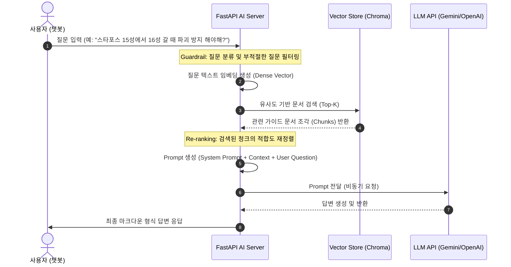

# AI & RAG 파이프라인 설계서 (AI Pipeline)

본 문서는 메이플스토리 챗봇의 핵심 지능인 **RAG (Retrieval-Augmented Generation)** 파이프라인과 인공지능 통신 구조를 정의합니다.

## 1. RAG 파이프라인 흐름도

사용자의 질문이 들어왔을 때 관련 정보를 검색하여 답변을 생성하기까지의 실시간 흐름은 다음과 같습니다.

---

## 2. 세부 설계 요소

### A. 텍스트 전처리 및 청킹 (Chunking) 전략
* **데이터 원천:** 메이플스토리 공식 가이드, 큐브/강화 확률표, 패치노트 텍스트.
* **청크 크기 (Chunk Size):** 500자 내외, 오버랩(Overlap) 50~100자.
* **테이블 파싱:** 확률표와 같은 구조화된 데이터는 단순 줄바꿈으로 나누면 문맥이 손실되므로, Markdown Table 형식 또는 JSON-like 구조로 변환한 후 단일 청크로 유지하는 전략을 취합니다.
* **메타데이터 속성:** `source`(공식 홈페이지, 나무위키 등), `category`(패치노트, 강화, 보스, 이벤트), `date`(업데이트 날짜)를 태그로 삽입하여 필터링 검색이 가능하게 합니다.

### B. 임베딩 및 벡터 저장소
* **임베딩 모델:** `text-embedding-3-small` (OpenAI) 또는 한국어 성능이 뛰어난 `KoSimCSE` 활용.
* **벡터 스토어:** 로컬 개발 단계에서는 `ChromaDB`를 사용하고, 상용 배포 단계에서는 완전 관리가 가능한 `Pinecone` 혹은 `pgvector`로의 확장을 고려합니다.
* **검색 메트릭:** Cosine Similarity 기반의 거리 측정 방식을 사용합니다.

### C. 프롬프트 엔지니어링 (Prompt Engineering)
* **시스템 프롬프트 (System Prompt) 핵심 가이드:**
  - 챗봇의 페르소나 설정: "친절하고 메이플스토리에 해박한 인공지능 비서, **'메이(MAI)'**"
  - 가드레일: "제시된 Context 정보만을 기반으로 답변하고, 확실하지 않은 정보는 '공식 홈페이지나 인게임 정보를 다시 확인해주세요'라고 답변할 것."
  - 인게임 용어 매핑: "스타포스 강화, 잠재능력 재설정, 에디셔널, 추옵(추가옵션)" 등의 축약어를 LLM이 올바르게 이해할 수 있도록 프롬프트에 동의어 사전(Synonym Dictionary)을 내장합니다.

### D. 하이브리드 검색 (Hybrid Search) 및 재정렬 (Re-ranking)
* 단순 벡터 유사도(Dense Retrieval)만으로는 "스타포스 22성"과 같은 고유 대명사나 정확한 키워드 매칭이 어려울 수 있습니다.
* **해결책:** BM25 기반의 키워드 검색(Sparse Retrieval)과 Dense 벡터 검색을 결합하고, `Cohere Re-ranker` 또는 오픈소스 한국어 크로스 인코더를 사용하여 검색 결과의 정확도를 향상시킵니다 (세부 구현은 `ai_server/services/rag.py`에 작성 예정).
