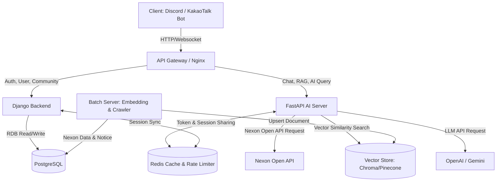

# 시스템 아키텍처 설계서 (System Design)

본 문서는 메이플스토리 챗봇 서비스(`maple-chatbot-mai-v2`)의 전체 시스템 아키텍처와 컴포넌트 간 상호작용을 정의합니다.

## 1. 시스템 아키텍처 개요

메이플스토리 챗봇 서비스는 대용량 트래픽 처리와 비동기 I/O 바운드 작업(Nexon Open API 호출 및 LLM 호출)의 최적화를 위해 **Django (동기/인증/RDB 관리)**와 **FastAPI (비동기/AI 파이프라인/Nexon API 프록시)**의 하이브리드 아키텍처를 채택하였습니다.

---

## 2. 주요 컴포넌트 역할

### A. Client (Chatbot Interface)
* **역할:** 디스코드 봇(Discord Bot) 혹은 카카오톡 채널 챗봇을 통해 유저의 명령어 입력을 수신하고 응답을 출력합니다.
* **이유:** 메이플스토리 유저들이 게임 플레이 중(특히 사냥이나 대기 시간) 웹 브라우저를 켜지 않고도 디스코드 오버레이 등을 통해 편리하게 정보를 조회할 수 있도록 챗봇 환경을 최우선으로 지원합니다.

### B. Django Backend (Web & Auth & DB Management)
* **역할:** 회원가입, 로그인, JWT 인증 토큰 발급, 메이플스토리 캐릭터 연동(Verification) 처리, 커뮤니티 데이터 및 서비스 전반의 정적 데이터를 관리합니다.
* **이유:** Django의 강력한 ORM, 기본 제공되는 보안 기능(비밀번호 해싱, CSRF 방지 등), 어드민 페이지(Admin Panel) 등을 통해 사용자 관리 및 서비스 운영의 효율성을 극대화합니다.

### C. FastAPI AI Server (Async Chat & AI Pipeline)
* **역할:** 챗봇과의 인터페이스 역할, 메이플스토리 공식 데이터 실시간 조회(Nexon Open API 프록시), RAG(Retrieval-Augmented Generation) 기반의 지식 검색 및 LLM과의 비동기 통신을 처리합니다.
* **이유:** Nexon Open API 호출 및 LLM API 호출은 대기 시간이 긴 I/O 바운드 작업이므로, `async/await` 기반의 비동기 프레임워크인 FastAPI를 활용하여 적은 자원으로 대규모 동시 요청을 효율적으로 처리합니다.

### D. Redis (Cache & Rate Limiter)
* **역할:** Nexon Open API 호출 결과 캐싱, 유저별 API 호출 빈도 제한(Rate Limit), 세션 및 토큰 검증 캐싱.
* **이유:** Nexon Open API는 일일 호출 제한(Rate Limit)이 존재하므로 동일한 캐릭터의 정보 조회는 Redis에 일정 시간 캐싱하여 API 키 소모를 방지하고 응답 속도를 향상시킵니다.

### E. Vector DB (ChromaDB / Pinecone)
* **역할:** 메이플스토리 게임 가이드, 패치노트, 큐브 확률 데이터 등의 텍스트 임베딩(Vector)을 저장하고 유사도 검색을 지원합니다.
* **이유:** LLM이 학습하지 못한 실시간 정보 및 메이플스토리만의 복잡한 게임 규칙을 보완하기 위해 RAG 아키텍처용 Vector Store가 필수적입니다.

---

## 3. 핵심 시나리오 흐름

### 1) 캐릭터 정보 실시간 조회 (전적 검색)
1. 사용자가 챗봇에 `!전적 [캐릭터명]` 명령어를 입력합니다.
2. 챗봇이 FastAPI 서버의 `/api/v1/chat/character` API를 호출합니다.
3. FastAPI는 Redis 캐시를 조회하여 최근(예: 10분 내) 조회 이력이 있는지 확인합니다.
4. **Cache Miss 시:** Nexon Open API를 통해 비동기(`aiohttp`)로 캐릭터 OID 및 스탯 정보를 조회 후 Redis에 캐싱합니다.
5. 데이터를 정제하여 챗봇에 응답하고 챗봇이 UI(Embed 형식)로 유저에게 보여줍니다.

### 2) RAG 기반 AI 질문 답변 (예: "스타포스 17성 강화 비용 기대값은?")
1. 사용자가 챗봇에 메이플스토리 관련 자연어 질문을 입력합니다.
2. 챗봇이 FastAPI 서버로 질문을 전송합니다.
3. FastAPI는 질문을 임베딩 모델(OpenAI text-embedding-3 or Gemini)을 통해 벡터로 변환합니다.
4. Vector DB에서 질문과 유사도가 높은 메이플스토리 가이드 및 확률 테이블 문서를 검색(Retrieve)합니다.
5. 검색된 컨텍스트(Context)와 질문을 결합하여 LLM(Prompt)에 전달하고, 답변을 생성(Generate)합니다.
6. 생성된 답변을 챗봇 채널로 반환합니다.
