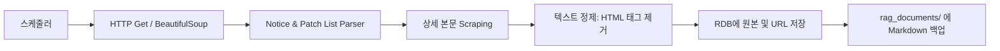

# 공식 홈페이지 크롤러 설계서 (Crawler Design)

본 문서는 메이플스토리 공식 홈페이지의 업데이트 정보, 공지사항, 이벤트를 주기적으로 모니터링하고 텍스트 데이터를 수집하는 **크롤러 시스템**을 정의합니다.

## 1. 크롤링 파이프라인 흐름

---

## 2. 크롤러 스펙 및 구현 가이드

### 1) 기술 스택
* **HTTP Client:** `httpx` (FastAPI와의 통신 조화를 위해 비동기 I/O 지원 클라이언트 권장)
* **HTML Parser:** `BeautifulSoup4` (lxml 파서 연동)
* **안전한 스크래핑:** 넥슨 홈페이지는 과도한 요청 발생 시 IP 차단(Blocking)이 발생할 수 있습니다.
  - **방어 코드:** 헤더에 브라우저와 유사한 `User-Agent` 설정, 요청 당 1.0~2.0초의 랜덤한 지연 시간(Delay) 주입.

### 2) 타겟 페이지 정보
* **공지사항:** `https://maplestory.nexon.com/News/Notice`
* **업데이트:** `https://maplestory.nexon.com/News/Update`
* **이벤트:** `https://maplestory.nexon.com/News/Event`

### 3) 데이터베이스 저장 구조 (Crawler Output)
정제된 HTML 텍스트 및 메타데이터는 Django 데이터베이스의 `crawled_documents` 테이블에 먼저 저장됩니다.

| 필드명 | 데이터 타입 | 설명 |
| :--- | :--- | :--- |
| `id` | BIGINT (PK) | 자동 증가 ID |
| `title` | VARCHAR(255) | 공지사항 제목 |
| `url` | VARCHAR(500) | 공식 홈페이지 원본 링크 |
| `content` | TEXT | 정제된 마크다운/텍스트 본문 |
| `published_at` | TIMESTAMP | 공지 등록 일시 |
| `is_embedded` | BOOLEAN | 임베딩 파이프라인 적재 완료 여부 (기본값: False) |

---

## 3. 에러 처리 및 스케줄러 설정

1. **에러 감지 및 슬랙 알림**
   - 넥슨 웹사이트 레이아웃이 변경되어 파서가 작동하지 않을 경우(CSS Selector Match Fail) `ValueError`를 발생시키고 관리자 채널(Discord Webhook 등)로 즉시 알림을 발송하도록 구성합니다.
2. **크롤링 실행 주기**
   - **평시:** 매 3시간마다 신규 공지 수집.
   - **패치 예정일(목요일):** 목요일 오전 08:00 ~ 12:00 사이에는 15분 주기로 촘촘하게 크롤링을 수행하여 패치노트 누락을 실시간 방지합니다.
   - 해당 주기는 Python의 `celery-beat` 혹은 `APScheduler`를 이용해 처리할 것을 제안합니다.
