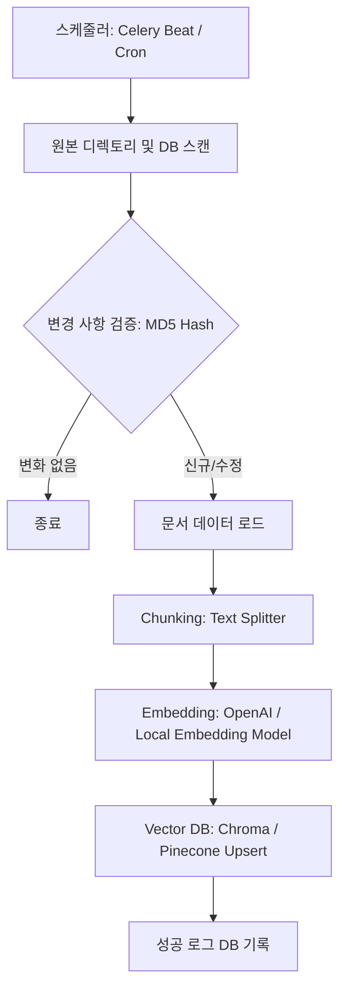

# 임베딩 적재 파이프라인 설계서 (Embedding Pipeline)

본 문서는 메이플스토리 공식 가이드 문서, 확률표 데이터 및 크롤링한 공지사항을 벡터 데이터베이스에 주기적으로 임베딩하여 적재하는 **배치 파이프라인**을 정의합니다.

## 1. 파이프라인 워크플로우

새로운 게임 가이드 파일 혹은 업데이트 공지가 추가되었을 때의 배치 처리 절차입니다.

---

## 2. 배치 스펙 및 구현 가이드

### 1) 기술 스택
* **스케줄러:** 파이썬 `schedule` 라이브러리 또는 `Celery Beat` 사용 (비동기 스케줄 가동).
* **텍스트 스플리터 (Text Splitter):** LangChain의 `RecursiveCharacterTextSplitter` 활용.
* **임베딩 변환:** OpenAI API 혹은 HuggingFace `SentenceTransformer` 기반의 비동기 Batch API 사용.

### 2) 데이터 파티셔닝 & 해시 검증 (MD5 Checksum)
* **이유:** 임베딩 API 호출은 텍스트 양이 많을수록 비용(OpenAI API 비용 또는 CPU/GPU 자원)이 추가되므로, 매번 모든 문서를 처음부터 다시 인덱싱하는 것은 비효율적입니다.
* **전략:**
  - 각 문서 파일의 원본 텍스트에 대한 `MD5 Hash` 값을 계산하여 RDB 혹은 로컬 메타데이터 파일에 기록해 둡니다.
  - 배치가 시작되면 대상 문서들의 현재 해시값과 기록된 이전 해시값을 비교하여, **해시가 변경된 문서만** 다시 스플릿 및 임베딩 처리하도록 설계합니다.
  - 삭제된 문서의 경우 메타데이터의 ID를 참조하여 벡터 스토어에서 직접 삭제(`delete(ids=[...])`)를 처리합니다.

---

## 3. 주기 및 예외 처리 정책

* **실행 주기:**
  - 메이플스토리 패치가 매주 목요일 오전에 진행되는 패턴을 고려하여, **매주 목요일 오전 11:00**에 크롤링 완료 후 임베딩 배치가 즉시 구동되도록 설정합니다.
* **예외 처리:**
  - LLM API 호출 횟수 제한(Rate Limit) 초과로 인한 API 에러 발생 시, `Exponential Backoff` 알고리즘을 이용한 재시도(Retry) 메커니즘을 내장합니다.
