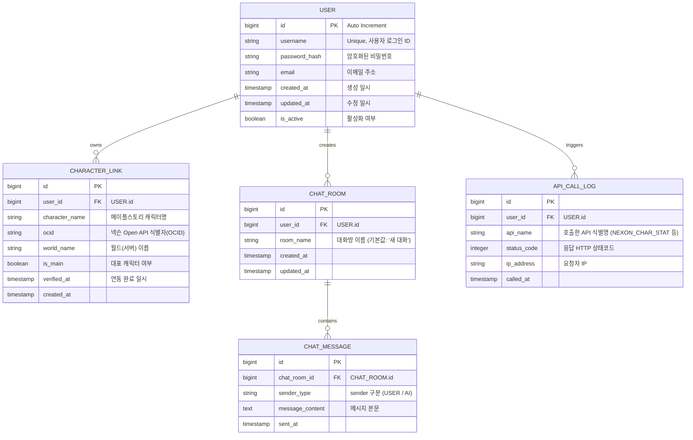

# 데이터베이스 관계도 (Entity Relationship Diagram)

본 문서는 메이플스토리 챗봇 서비스(`maple-chatbot-mai-v2`)에서 사용하는 관계형 데이터베이스(RDB)의 스키마와 테이블 간 관계(ERD)를 정의합니다.

## 1. Mermaid ERD

---

## 2. 테이블 관계 설명 및 설계 의도

1. **USER & CHARACTER_LINK (1:N 관계)**
   * **설명:** 한 명의 회원은 메이플스토리에 존재하는 여러 개의 캐릭터를 연동할 수 있습니다.
   * **이유:** 메이플스토리는 본캐(대표 캐릭터) 외에도 여러 부캐릭터(유니온 등)를 육성하는 특성이 있으므로 다중 캐릭터 연동을 기본 지원합니다. 이 중 가장 자주 사용하는 대표 캐릭터는 `is_main` 플래그를 True로 설정하여 기본 조회 대상으로 활용합니다.

2. **USER & CHAT_ROOM & CHAT_MESSAGE (계층 구조)**
   * **설명:** 사용자는 여러 개의 대화방을 가질 수 있고, 하나의 대화방에는 유저와 AI의 대화 메시지들이 쌓이게 됩니다.
   * **이유:** 사용자가 과거에 질문했던 히스토리를 대화방 단위로 격리하여 조회할 수 있게 하고, LLM의 컨텍스트 윈도우 관리를 위해 대화 메모리를 방 단위로 조회할 수 있도록 설계했습니다.

3. **USER & API_CALL_LOG (1:N 관계)**
   * **설명:** 사용자가 넥슨 API 혹은 AI API를 유발할 때마다 호출 이력을 로깅합니다.
   * **이유:** 넥슨 Open API의 호출 횟수 제한(Rate Limit)을 모니터링하고 어뷰징(Abuse) 유저를 방지하기 위해 사용자 기반의 API 호출 실시간 누적 로깅이 필수적입니다.
