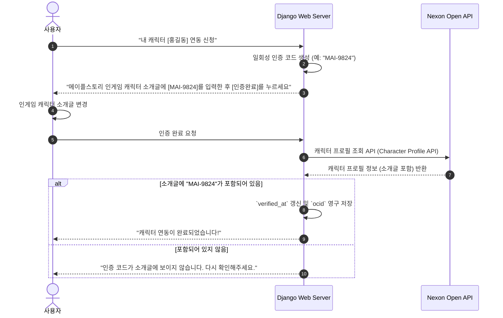

# 회원 및 캐릭터 연동 스키마 설계서 (Users & Characters)

본 문서는 회원 관리(`User`)와 메이플스토리 캐릭터 연동(`CharacterLink`) 테이블의 물리 테이블 명세 및 세부 설계 의도를 다룹니다.

## 1. 물리 테이블 명세

### 1) `auth_user` 테이블 (기본 사용자 테이블)

Django의 기본 `AbstractUser`를 확장하거나 커스텀하여 사용합니다.

| 컬럼명 | 데이터 타입 | Nullable | Key | 기본값 | 설명 |
| :--- | :--- | :--- | :--- | :--- | :--- |
| `id` | BIGINT | N | PK | Auto | 사용자 일련번호 |
| `username` | VARCHAR(150) | N | Unique | - | 로그인 ID (영문/숫자 조합) |
| `password` | VARCHAR(128) | N | - | - | PBKDF2/bcrypt 해싱된 비밀번호 |
| `email` | VARCHAR(254) | Y | - | - | 이메일 주소 |
| `is_active` | BOOLEAN | N | - | True | 계정 활성화 상태 여부 |
| `date_joined` | TIMESTAMP | N | - | CURRENT_TIMESTAMP | 가입 일시 |

* **보안 가이드:** 비밀번호는 평문으로 절대 저장하지 않으며 Django의 기본 해싱 엔진(`PBKDF2PasswordHasher`) 또는 `Argon2`를 권장합니다.

---

### 2) `character_link` 테이블 (메이플 캐릭터 연동)

| 컬럼명 | 데이터 타입 | Nullable | Key | 기본값 | 설명 |
| :--- | :--- | :--- | :--- | :--- | :--- |
| `id` | BIGINT | N | PK | Auto | 연동 일련번호 |
| `user_id` | BIGINT | N | FK | - | `auth_user.id` 참조 |
| `character_name` | VARCHAR(50) | N | - | - | 메이플스토리 캐릭터명 (대소문자 구분 없음) |
| `ocid` | VARCHAR(100) | N | Unique | - | 넥슨 Open API에서 사용하는 캐릭터 고유 식별자 |
| `world_name` | VARCHAR(30) | N | - | - | 캐릭터 소속 월드 (예: 스카니아, 루나) |
| `is_main` | BOOLEAN | N | - | False | 대표 캐릭터 여부 |
| `verified_at` | TIMESTAMP | Y | - | NULL | 본인 캐릭터 인증 완료 일시 |
| `created_at` | TIMESTAMP | N | - | CURRENT_TIMESTAMP | 레코드 생성 일시 |

---

## 2. 메이플스토리 캐릭터 인증 프로세스 (Verification)

유저가 타인의 캐릭터를 사칭하여 전적 조회를 잠그거나 챗봇 내 대표 캐릭터로 설정하는 것을 방지하기 위해 다음과 같은 본인 인증 프로세스를 제공할 수 있습니다.

* **인증 설계 이유:** 넥슨 API를 통한 캐릭터 상세 조회 시, 해당 캐릭터의 인게임 정보(소개글 등)를 실시간으로 받아와 대조하는 방식이 가장 안전하고 확실하게 본인 소유를 증명하는 수단입니다.
