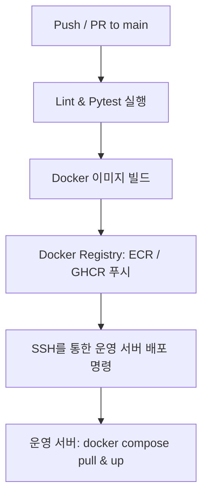

# 배포 설계서 (Deployment Architecture)

본 문서는 메이플스토리 챗봇 백엔드 서비스의 지속적 통합/지속적 배포(CI/CD) 파이프라인 및 클라우드 배포 구조를 정의합니다.

## 1. CI/CD 파이프라인 (GitHub Actions)

코드 저장소(`main` 브랜치)에 머지되었을 때 작동하는 CI/CD 워크플로우 설계 초안입니다.



### GitHub Actions Workflow 예시 (`.github/workflows/deploy.yml`)
```yaml
name: Deploy to Production

on:
  push:
    branches: [ main ]

jobs:
  test:
    runs-on: ubuntu-latest
    steps:
      - uses: actions/checkout@v3
      - name: Set up Python
        uses: actions/setup-python@v4
        with:
          python-version: '3.11'
      - name: Install dependencies
        run: |
          python -m pip install --upgrade pip
          pip install -r requirements.txt
      - name: Run Pytest
        run: pytest

  build-and-deploy:
    needs: test
    runs-on: ubuntu-latest
    steps:
      - name: Deploy via SSH
        uses: appleboy/ssh-action@master
        with:
          host: ${{ secrets.SERVER_HOST }}
          username: ${{ secrets.SERVER_USER }}
          key: ${{ secrets.SERVER_SSH_KEY }}
          script: |
            cd /home/ubuntu/maple-chatbot-mai-v2
            git pull origin main
            docker compose down
            docker compose up --build -d
```

---

## 2. 운영 배포 아키텍처

클라우드(AWS EC2, NCP 등)에 최종 배포되는 구조는 아래의 리버스 프록시(Reverse Proxy)를 기반으로 합니다.

* **Nginx (API Gateway & SSL):**
  - 클라이언트의 HTTPS (Port 443) 요청을 처리하고 SSL 인증서(Let's Encrypt)를 강제합니다.
  - `/api/v1/auth`, `/admin` 등은 Django 컨테이너(`http://django-web:8000`)로 라우팅합니다.
  - `/api/v1/chat`, `/api/v1/ai` 등은 비동기 FastAPI 컨테이너(`http://fastapi-ai:8001`)로 라우팅합니다.

* **보안 및 포트 차단:**
  - 외부에서는 Nginx 포트(80, 443)만 접근 가능하도록 방화벽(Security Group)을 설정합니다.
  - PostgreSQL, Redis 및 각 애플리케이션의 본래 포트(5432, 6379, 8000, 8001)는 로컬 네트워크 내부망에서만 연동되도록 차단합니다.
