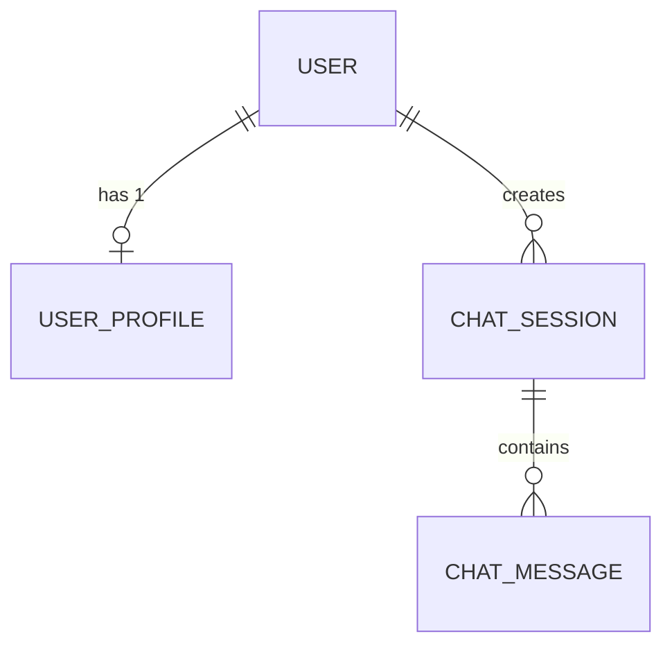

# 데이터베이스 스키마 설계 (DB Schema)

본 프로젝트는 PostgreSQL을 기본 데이터베이스로 사용하며, Django ORM을 통해 관리됩니다.

## 1. 주요 엔티티 관계도 (ERD 요약)

---

## 2. 테이블 상세 명세

### 2.1 User (Django `auth.User`)
Django에서 기본적으로 제공하는 사용자 테이블.
- `id`: Primary Key
- `username`: 계정 아이디
- `password`: 해시화된 비밀번호

### 2.2 UserProfile (`apps.accounts.models.UserProfile`)
메이플스토리 연동에 필요한 추가 정보를 담는 확장 테이블.
- `id`: Primary Key
- `user_id`: FK (`auth.User`), 1:1 관계
- `maple_nickname`: CharField (대표 캐릭터명)
- `nexon_api_key`: CharField (넥슨 오픈 API 호출용 개인 키)

### 2.3 ChatSession (`apps.chat.models.ChatSession`)
하나의 대화(채팅창) 단위를 나타냅니다.
- `session_id`: UUID, Primary Key
- `user_id`: FK (`auth.User`), Nullable (비회원 세션용)
- `created_at`: DateTime

### 2.4 ChatMessage (`apps.chat.models.ChatMessage`)
세션 안에서 주고받은 개별 메시지 로그입니다.
- `id`: Primary Key
- `session_id_id`: FK (`ChatSession`)
- `user_message`: Text (사용자 질문)
- `ai_response`: Text (AI의 전체 답변)
- `thinking`: Text (Qwen 등 Reasoning 모델의 중간 사고 과정 로깅)
- `response_time`: Integer (응답 소요 시간, 모니터링용)
- `created_at`: DateTime
